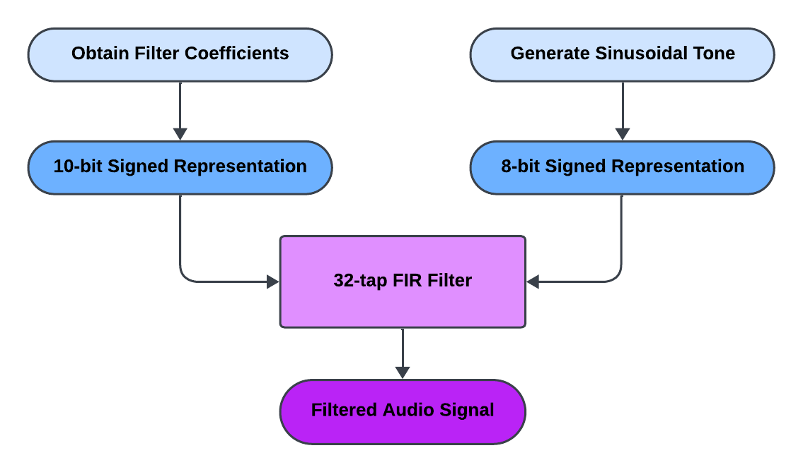
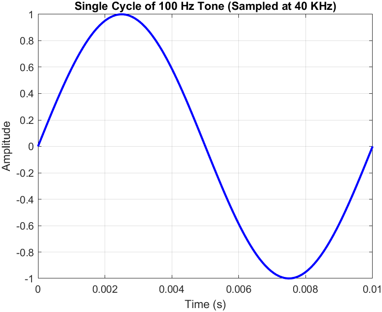
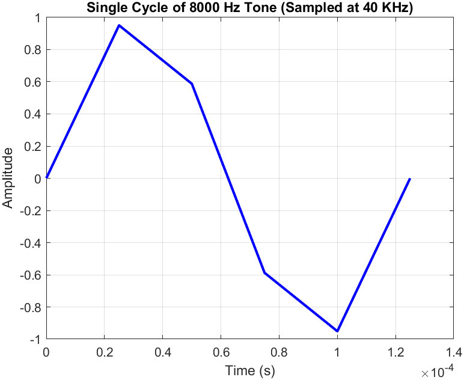

# Audio Equalizer Using FIR Filters

This project focuses on implementing a 32-tap low-pass Finite Impulse Response (FIR) filter for audio applications. Using a fixed-point representation, the filter is designed to allow frequencies below 500Hz while attenuating those above 1KHz. Verilog code is developed to create the filter's hardware architecture, and audio files are stored in ROM to test the filter's functionality. The project demonstrates effective low-pass filtering by passing a 100Hz tone while suppressing an 8KHz tone, validating its use in audio processing.

  

## Filter Coefficients

### Filter Design

For this project, we extracted the filters using the ``MATLAB filterDesigner``. The following parameters were used to create the required filter:
- Least-Squares Filter
- Sampling Frequency, Fs: 40kHz
- Transition Band: 500-1000Hz
- Order: 31
- Wpass: 1
- Wstop: 1
  
As a result, this was the magnitude response of the designed filter:

  

### Conversion to Binary
To represent the coefficients in signed 10-bit binary numbers, we scaled the coefficients by ``512`` and then converted the resulting fixed-point number into signed binary. These numbers were then used as parameters for the ``fir_low_pass_filter`` module in ``filter.v``. A ``MATLAB`` script was used for this process.

## Input Audio

### Generated Tones

Two audio tones were used to test the designed filter: one low-frequency audio of 100Hz, and the other high-frequency tone of 8kHz. The plots of the audio tones are shown below:

  

  

### Conversion to Binary
To convert the audio signals into 8-bit signed binary numbers, we first scaled the audio signal coefficients by a factor of ``128`` and then converted the fixed point numbers into signed binary numbers. These numbers were stored in a ``.txt`` file, and then eventually into a ``ROM`` module. For this process, a ``MATLAB`` script was used.
